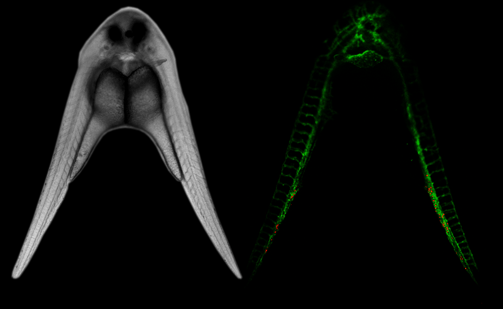

## Welcome to the Blaser Lab

[CXCR1 remodels the vascular niche to promote hematopoietic stem and progenitor cell engraftment](https://pubmed.ncbi.nlm.nih.gov/28351983/)

Welcome to the Blaser Lab Github page!  This serves as our lab website. Why not?  Github is a great resource that we use daily and from here you can find all of the papers and other resources we have published.  

Our lab is interested in hematopoiesis and leukemogenesis. The image you see above is related to one of my papers from a few years ago.  Using parabiotic zebrafish we found a way to make the zebrafish hematopoietic microenvironemt support more stem cells. The main question we have in the lab now is how does the hematopoietic microenvironment control long-term hematopoietic stem cell fate.  Fate can be defined phylogenetically and in some ways can be thought of as clonal diversity.  Fate can also be defined phenotypically which we often describe through functional assays and/or transcriptional state.  We study HSC fate in the zebrafish model using genetics, cellular barcoding, time-lapse imaging, and single cell transcriptomic and epigenetic assays.  By understanding how the microenvironment alters these aspects of HSC fate, we can understand more about how leukemia develops.  We may also be able to preserve HSC clonal diversity under conditions of stress such as hematopoietic stem cell transplantation.   

[Click here for my NCBI Bibliography](https://www.ncbi.nlm.nih.gov/myncbi/bradley.blaser.1/bibliography/public/)

## Selected Research Publications

Here are links to some recent papers with their corresponding data and analysis packages.

Code to generate all R-based figures (probably 90-95% of the panels for most manuscripts) is stored in an analysis project.  These are public git repositories.  They will only work if you also have the companion data package.  The data packages are elsewhere - either in figshare or another repository if required by the journal.  Instructions for installing and using the code and data together are provided on the analysis project README. 

* [Microenvironmental control of hematopoietic stem cell fate via CXCL8 and protein kinase C.](https://pubmed.ncbi.nlm.nih.gov/37209097/)
	* We found that protein kinase C delta (PKC-&#948)is transcriptionally quiet in the zebrafish vascular niche
	* Dysregulation of PKC-&#948 increases HSC clonal diversity and expands polyclonal immature neutrophils and erythrocytes
	* cxcl8 signals through PKC-&#948, the focal adhesion complex and ERK, remodeling the vascular niche and inducing expression of hematopoietic factors.
	* [Analysis Project](https://github.com/blaserlab/pkc_cxcl8)
	* [Data Package](https://data.mendeley.com/datasets/6s7vy929dc)

* [BMX kinase mediates gilteritinib resistance in FLT3-mutated AML through microenvironmental factors.](https://pubmed.ncbi.nlm.nih.gov/35797240/)
	* Sc-RNAseq Analysis of bone marrow samples from Flt3-AML patients treated with Gilteritinib.
	* We find BMX kinase and chemokines upregulated in patients resistant to Gilteritinib.
	* [Analysis Project](https://github.com/blaserlab/flt3_aml_bakerlab)
	* [Data Package](https://doi.org/10.6084/m9.figshare.23535606)

## Computational Resources

### [blaseRtemplates](https://blaserlab.github.io/blaseRtemplates/)

This started out as project setup templates.

It expanded to become a general utility package for setting up projects and handling packages.

Then it expanded again to become a deployable computational environment for single or multi-user systems.  Works on Mac, Linux and Windows.

It takes some concepts from *renv*, incorporates *pak* as the default installation tool which massively improves speed, and enforces many optimized parameters for installation and cacheing functions.

### [blaseRtools](https://blaserlab.github.io/blaseRtools/index.html)

The underlying philosophy of blaseRtools is that we try to reduce the cognitive burden related to working with diverse sets of bioinformatics tools.  We try to process raw data into common data structures that are as simple to understand and work with as possible.  

The primary focus is on tools for downstream analysis and visualization of single cell RNAseq data.  A secondary set of functions focuses on manipulation of genomic sequences and export to genebank files for interactive use outside of R.

### [R Universe blaserlab repo](https://blaserlab.r-universe.dev/ui#builds)

This is like a CRAN repo for everybody.  This is your best option for installing blaseRtools and blaseRtemplates.  MAC and Windows binaries are available.  See the top of the page for instructions on how to enable blaserlab repo.

## Laboratory Resources

* [Recipes](https://github.com/blaserlab/recipes):  Basic recipes we use regularly for fish work, cloning and molecular biology.
* [Protocols](https://github.com/blaserlab/general_protocols):  These are protocols we use for cloning, fish work etc.  WIP.

## Teaching
### [Datascience Workshop 2023](https://blaserlab.github.io/datascience.curriculum/)

The course is complete for 2023.  You can find the course page and links to the tutorial videos at the link above.  

## People

* [Brad Blaser](https://github.com/blaserleb):  Assistant Professor of Medicine,  OSU College of Medicine, Division of Hematology.  
* [Wantong Li](https://github.com/WantongLii):  Wantong is a third-year graduate student in the OSU MCDB program.
* [Konur Oyman](https://github.com/oyman4):  Konur is a second-year graduate student in the OSU MCDB program.
* [Annika Chura](https://github.com/annikachura):  Annika is a second-year graduate student in the OSU MCDB program.

<!--
**blaserlab/blaserlab** is a ✨ _special_ ✨ repository because its `README.md` (this file) appears on your GitHub profile.

Here are some ideas to get you started:

- 🔭 I’m currently working on ...
- 🌱 I’m currently learning ...
- 👯 I’m looking to collaborate on ...
- 🤔 I’m looking for help with ...
- 💬 Ask me about ...
- 📫 How to reach me: ...
- 😄 Pronouns: ...
- ⚡ Fun fact: ...
-->
